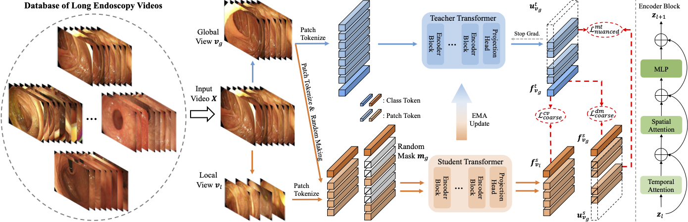

# EndoFM-LV
<!-- select Model and/or Data and/or Code as needed>
### Welcome to OpenMEDLab! 👋

<!--
**Here are some ideas to get you started:**
🙋‍♀️ A short introduction - what is your organization all about?
🌈 Contribution guidelines - how can the community get involved?
👩‍💻 Useful resources - where can the community find your docs? Is there anything else the community should know?
🍿 Fun facts - what does your team eat for breakfast?
🧙 Remember, you can do mighty things with the power of [Markdown](https://docs.github.com/github/writing-on-github/getting-started-with-writing-and-formatting-on-github/basic-writing-and-formatting-syntax)
-->


<!-- Insert the project banner here -->

[//]: # (<div align="center">)

[//]: # (    <a href="https://"></a>)

[//]: # (</div>)

[//]: # (---)

<!-- Select some of the point info, feel free to delete -->

[//]: # ([![Twitter]&#40;https://img.shields.io/twitter/url?style=social&url=https%3A%2F%2Ftwitter.com%2Fopendilab&#41;]&#40;https://twitter.com/opendilab&#41;)

[//]: # ([![PyPI]&#40;https://img.shields.io/pypi/v/DI-engine&#41;]&#40;https://pypi.org/project/DI-engine/&#41;)

[//]: # (![Conda]&#40;https://anaconda.org/opendilab/di-engine/badges/version.svg&#41;)

[//]: # (![Conda update]&#40;https://anaconda.org/opendilab/di-engine/badges/latest_release_date.svg&#41;)

[//]: # (![PyPI - Python Version]&#40;https://img.shields.io/pypi/pyversions/DI-engine&#41;)

[//]: # (![PyTorch Version]&#40;https://img.shields.io/badge/dynamic/json?color=blue&label=pytorch&query=%24.pytorchVersion&url=https%3A%2F%2Fgist.githubusercontent.com/PaParaZz1/54c5c44eeb94734e276b2ed5770eba8d/raw/85b94a54933a9369f8843cc2cea3546152a75661/badges.json&#41;)

[//]: # ()
[//]: # ()
[//]: # (![Loc]&#40;https://img.shields.io/endpoint?url=https://gist.githubusercontent.com/HansBug/3690cccd811e4c5f771075c2f785c7bb/raw/loc.json&#41;)

[//]: # (![Comments]&#40;https://img.shields.io/endpoint?url=https://gist.githubusercontent.com/HansBug/3690cccd811e4c5f771075c2f785c7bb/raw/comments.json&#41;)

[//]: # ()
[//]: # (![Style]&#40;https://github.com/opendilab/DI-engine/actions/workflows/style.yml/badge.svg&#41;)

[//]: # (![Docs]&#40;https://github.com/opendilab/DI-engine/actions/workflows/doc.yml/badge.svg&#41;)

[//]: # (![Unittest]&#40;https://github.com/opendilab/DI-engine/actions/workflows/unit_test.yml/badge.svg&#41;)

[//]: # (![Algotest]&#40;https://github.com/opendilab/DI-engine/actions/workflows/algo_test.yml/badge.svg&#41;)

[//]: # (![deploy]&#40;https://github.com/opendilab/DI-engine/actions/workflows/deploy.yml/badge.svg&#41;)

[//]: # ([![codecov]&#40;https://codecov.io/gh/opendilab/DI-engine/branch/main/graph/badge.svg?token=B0Q15JI301&#41;]&#40;https://codecov.io/gh/opendilab/DI-engine&#41;)

[//]: # ()
[//]: # (![GitHub Org's stars]&#40;https://img.shields.io/github/stars/opendilab&#41;)

[//]: # ([![GitHub stars]&#40;https://img.shields.io/github/stars/opendilab/DI-engine&#41;]&#40;https://github.com/Med-AIR/Endo-FM/stargazers&#41;)

[//]: # ([![GitHub forks]&#40;https://img.shields.io/github/forks/opendilab/DI-engine&#41;]&#40;https://github.com/Med-AIR/Endo-FM/network&#41;)

[//]: # (![GitHub commit activity]&#40;https://img.shields.io/github/commit-activity/m/opendilab/DI-engine&#41;)

[//]: # ([![GitHub issues]&#40;https://img.shields.io/github/issues/opendilab/DI-engine&#41;]&#40;https://github.com/opendilab/DI-engine/issues&#41;)

[//]: # ([![GitHub pulls]&#40;https://img.shields.io/github/issues-pr/opendilab/DI-engine&#41;]&#40;https://github.com/opendilab/DI-engine/pulls&#41;)

[//]: # ([![Contributors]&#40;https://img.shields.io/github/contributors/opendilab/DI-engine&#41;]&#40;https://github.com/opendilab/DI-engine/graphs/contributors&#41;)

[//]: # ([![GitHub license]&#40;https://img.shields.io/github/license/opendilab/DI-engine&#41;]&#40;https://github.com/Med-AIR/Endo-FM/blob/master/LICENSE&#41;)

[//]: # (Updated on 2023.06.09)


This repository provides the official PyTorch implementation of the paper [**Improving Foundation Model for Endoscopy Video Analysis via Representation Learning on Long Sequences**](TBA)
by [Zhao Wang](https://kyfafyd.wang), Chang Liu, Lingting Zhu, Tongtong Wang, [Shaoting Zhang](http://www.qingyuan.sjtu.edu.cn/a/Shaoting-Zhang.html)†, and [Qi Dou](http://www.cse.cuhk.edu.hk/~qdou)†.

<div align="center">
    <a href="https://"></a>
</div>

## Key Features


[//]: # (key feature bulletin points here)
- First foundation model for learning from long endoscopy videos via self-supervised pre-train.
- A large-scale long endoscopy video dataset consisting of 6469 long sequences with an average duration of 68.1 seconds.
- Promising performance on 4 different types of typical downstream endoscopic tasks, including classification, segmentation, detection, and workflow recognition.

[//]: # (## Links)

[//]: # ()
[//]: # (- [Paper]&#40;TBA&#41;)

[//]: # (- [Model]&#40;&#41;)

[//]: # (- [Code]&#40;https://github.com/med-air/Endo-FM&#41; )

[//]: # (<!-- [Code] may link to your project at your institute>)


<!-- give a introduction of your project -->

## Details

> Recent advancements in endoscopy video analysis have relied on the utilization of relatively short video clips extracted from longer videos or millions of individual frames. However, these approaches tend to neglect the domain-specific characteristics of endoscopy data, which is typically presented as a long stream containing valuable semantic spatial and temporal information. To address this limitation, we propose EndoFM-LV, a foundation model developed under a minute-level pre-training framework upon long endoscopy video sequences. To be specific, we propose a novel masked token modeling scheme within a teacher-student framework for self-supervised video pre-training, which is tailored for learning representations from long video sequences. For pre-training, we construct a large-scale long endoscopy video dataset comprising 6,469 long endoscopic video samples, each longer than 1 minute and totaling over 13 million frames. Our EndoFM-LV is evaluated on four types of endoscopy tasks, namely classification, segmentation, detection, and workflow recognition, serving as the backbone or temporal module. Extensive experimental results demonstrate that our framework outperforms previous state-of-the-art video-based and frame-based approaches by a significant margin on those various downstream tasks.
<!-- Insert a pipeline of your algorithm here if got one -->


[//]: # (More intro text here.)


## Datasets

<div align="center">
    <a href="https://"></a>
</div>

We utilize 4 public and 1 private datasets for pre-training and 4 datasets as the downstream tasks.
Except for Cholec80, we provide our preprocessed data for pre-training and downstream tasks, you can directly download via the following links:
- [Pre-training](https://mycuhk-my.sharepoint.com/:u:/g/personal/1155167044_link_cuhk_edu_hk/EdBFU5KMF1dNoFN4TJcHnBkBuNJKP5gvk4BJOr4Jg-C0_w?e=RDeZaH)
- Downstream: [PolypDiag](https://mycuhk-my.sharepoint.com/:u:/g/personal/1155167044_link_cuhk_edu_hk/Ed_RCZ86IktKkGNNL5qX9IsBvNa7wcyM8q4yBQBkzaBj8g?e=pvuZVt), [CVC-12k](https://mycuhk-my.sharepoint.com/:u:/g/personal/1155167044_link_cuhk_edu_hk/EQzj78YsrVZAtbNVHW7WPEEBX1AeolLI7gmBkg-iEg1lQg?e=0gQPzy), [KUMC](https://mycuhk-my.sharepoint.com/:u:/g/personal/1155167044_link_cuhk_edu_hk/EQHKl1-MgA5Ams_sQ4_ssg8BFyd66qucAxUTEHz4lHxE7g?e=fFtXzd)

Note the preprocessing of Cholec80 for workflow recognition can refer to [SV-RCNet](https://github.com/YuemingJin/SV-RCNet).

## Get Started

#### Main Requirements
- torch==1.13.1
- torchvision==0.14.1
- pillow==10.0.1
- timm==0.9.7

#### Installation
We suggest using Anaconda to setup environment on Linux, if you have installed anaconda, you can skip this step.

```shell
wget https://repo.anaconda.com/archive/Anaconda3-2020.11-Linux-x86_64.sh && zsh Anaconda3-2020.11-Linux-x86_64.sh
```

Then, we can install packages using provided `environment.yaml`.

```shell
cd EndoFM-LV
conda env create -f environment.yaml
conda activate endofm-lv
```

[//]: # (#### Pre-trained Weights)

[//]: # (You can directly download our pre-trained Endo-FM via this [link]&#40;https://mycuhk-my.sharepoint.com/:u:/g/personal/1155167044_link_cuhk_edu_hk/EZh5mWE5CL1BpaJ1bXuokfYBDM2VaMknqG7YpaQBRgAvdQ?e=e2rVYW&#41; and put it under `checkpoints/` for downstream fine-tuning.)

[//]: # (Also, we provide the pre-trained weights of 3 downstream tasks via this [link]&#40;https://mycuhk-my.sharepoint.com/:f:/g/personal/1155167044_link_cuhk_edu_hk/Ei7k6w3Qic9PmSpuoRLwPbsBw1bLeh-3DrIuSAj4yedabA?e=uiDpCy&#41; for direct downstream testing.)

[//]: # (#### Preprocess)

#### Pre-trained Weights

You can directly download our pre-trained Endo-FM via this [link](https://mycuhk-my.sharepoint.com/:u:/g/personal/1155167044_link_cuhk_edu_hk/EauTiGd9hg9Lu_7JED3v1E0BwCZ2ZQTsdBfiFo58ADtrmg?e=AZAsP4) and put it under `checkpoints/` for downstream fine-tuning.


Also, we provide the pre-trained weights of 4 downstream tasks for direct downstream testing.

|    Dataset    | PolypDiag | CVC-12k | KUMC | Cholec80
|:--------------:|:----:|:----:|:-----:|:-----:|
| Weights | [link](https://mycuhk-my.sharepoint.com/:u:/g/personal/1155167044_link_cuhk_edu_hk/ER4Ji0TZwfRLp-hN8k2gNcEBSME3F1irUf3D7rwd2VlOTw?e=a0QfMo) | [link](https://mycuhk-my.sharepoint.com/:u:/g/personal/1155167044_link_cuhk_edu_hk/EbDtHpZGs41FssBEE6df4RcBdVa7NNz8CprdmB6QdQaTpw?e=csht6d) | [link](https://mycuhk-my.sharepoint.com/:u:/g/personal/1155167044_link_cuhk_edu_hk/ETWH2gMsqslIp2IRkqBFiRgB4lkIP2oTGJloPnZs2tYccg?e=kNsxgz) | [link](https://mycuhk-my.sharepoint.com/:u:/g/personal/1155167044_link_cuhk_edu_hk/ER4Ji0TZwfRLp-hN8k2gNcEBSME3F1irUf3D7rwd2VlOTw?e=a0QfMo) 


#### Pre-training
```shell
cd EndoFM-LV
bash scripts/train_endofm_lv.sh
```

#### Downstream Fine-tuning
```shell
# PolypDiag (Classification)
cd EndoFM-LV
bash scripts/eval_finetune_polypdiag.sh

# CVC (Segmentation)
cd EndoFM-LV/TransUNet
python train.py

# KUMC (Detection)
cd EndoFM-LV/STMT
python setup.py build develop
python -m torch.distributed.launch \
    --nproc_per_node=1 \
    tools/train_net.py \
    --master_port=$((RANDOM + 10000)) \
    --config-file configs/STFT/kumc_R_50_STFT.yaml \
    OUTPUT_DIR log_dir/kumc_finetune
    
# Cholec80 (Workflow Recognition)
cd EndoFM-LV/SV-RCNet
python train_singlenet_phase_1fc.py --exp endofm_lv
```

#### Direct Downstream Testing
```shell
# PolypDiag (Classification)
cd Endo-FM
bash scripts/test_finetune_polypdiag.sh

# CVC (Segmentation)
cd Endo-FM/TransUNet
python train.py --test

# KUMC (Detection)
cd Endo-FM/STMT
python setup.py build develop
python -m torch.distributed.launch \
    --nproc_per_node=1 \
    tools/test_net.py \
    --master_port=$((RANDOM + 10000)) \
    --config-file configs/STFT/kumc_R_50_STFT.yaml \
    MODEL.WEIGHT kumc.pth \
    OUTPUT_DIR log_dir/kumc_finetune

# Cholec80 (Workflow Recognition)
cd EndoFM-LV/SV-RCNet
python train_singlenet_phase_1fc.py --exp endofm_lv --test
```


## 🙋‍♀️ Feedback and Contact

For further questions, pls feel free to contact [Zhao Wang](mailto:zwang21@cse.cuhk.edu.hk).


## 🛡️ License

This project is under the Apache License 2.0 license. See [LICENSE](LICENSE) for details.

## 🙏 Acknowledgement

Our code is based on [DINO](https://github.com/facebookresearch/dino), [TimeSformer](https://github.com/facebookresearch/TimeSformer), [SVT](https://github.com/kahnchana/svt), [TransUNet](https://github.com/Beckschen/TransUNet), and [STFT](https://github.com/lingyunwu14/STFT). Thanks them for releasing their codes.

## 📝 Citation

If you find this code useful, please cite in your research papers.
```
@artical{
    wang2025improving,
    title={Foundation Model for Endoscopy Video Analysis via Large-scale Self-supervised Pre-train},
    author={Zhao Wang and Chang Liu and Lingting Zhu and Tongtong Wang and Shaoting Zhang and Qi Dou},
    booktitle={IEEE Journal of Biomedical and Health Informatics},
    pages={},
    year={2025}
}
```
